# Variation Jam

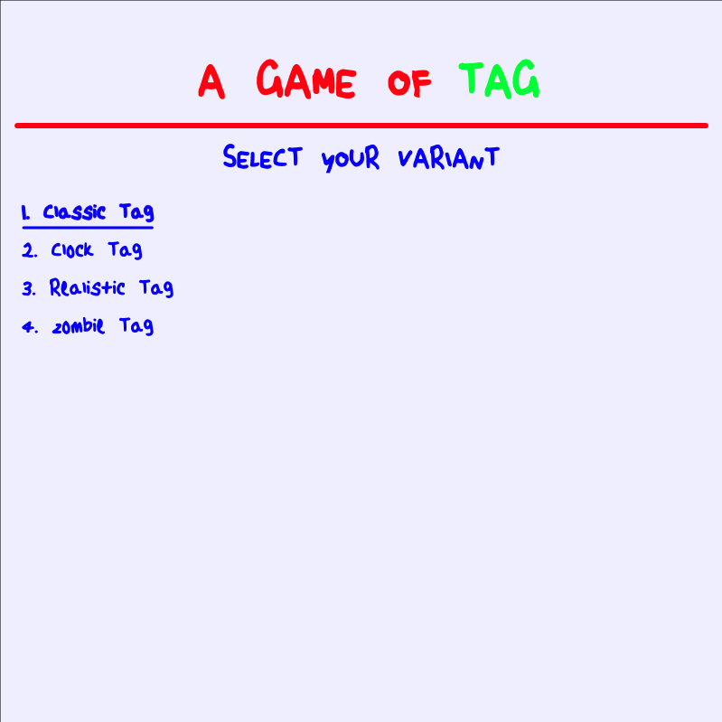

[View this project online](https://philippefutureboy.github.io/cu-cart253/projects/variation-jam)

We're playing tag with this one. Wacky, surprising, weird, normal, all sorts of tag!
Each game plays fairly differently.

# Table of Contents
- [Variation Jam](#variation-jam)
- [Table of Contents](#table-of-contents)
  - [Variations](#variations)
  - [Creative Process](#creative-process)
    - [Developping the Game AI Engine](#developping-the-game-ai-engine)
  - [Improvements \& Areas to Improve](#improvements--areas-to-improve)
    - [What have I improved since the Mod Jam?](#what-have-i-improved-since-the-mod-jam)
    - [What can I still improve?](#what-can-i-still-improve)
  - [Structure of the code](#structure-of-the-code)
  - [Attribution \& GenAI](#attribution--genai)
    - [Assets](#assets)
    - [Distribution of GenAI Contributions Across Files](#distribution-of-genai-contributions-across-files)
  - [License](#license)


**NOTE:**</br>
This README was modified after the deadline for the project, on Fri Dec 5th, 2025.</br>
This is the only file (alongside the screenshots) modified after the deadline.

## Variations

**Classic Tag** 

1-1 old-fashioned tag. Touch the adversary to make it "it", and vice-versa.
Time-bound to make games short-and-sweet, especially given the visual and game mechanic simplicity.
| | | |
|-|-|-|
|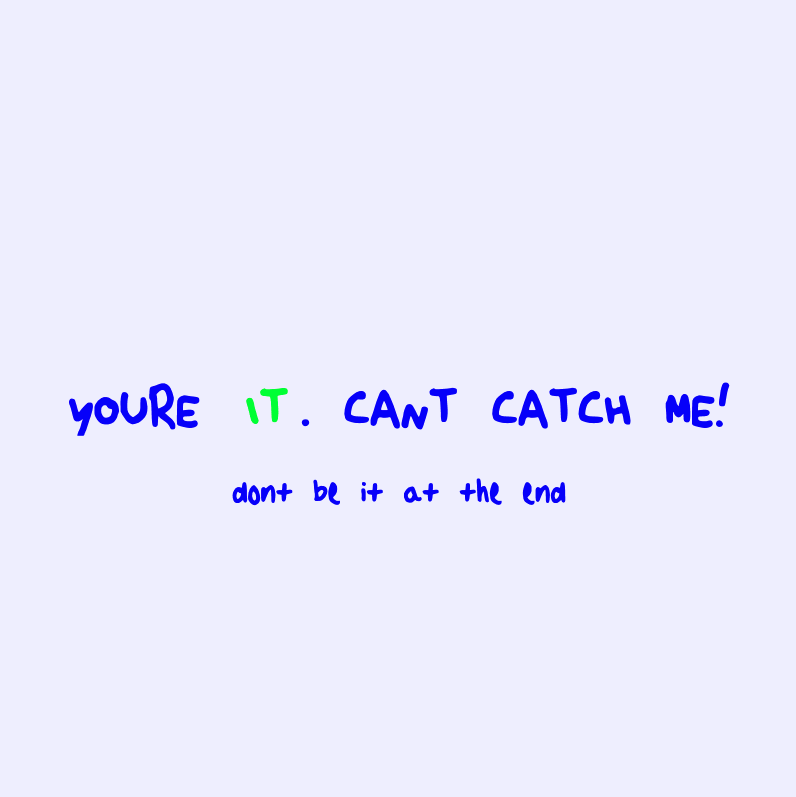 | 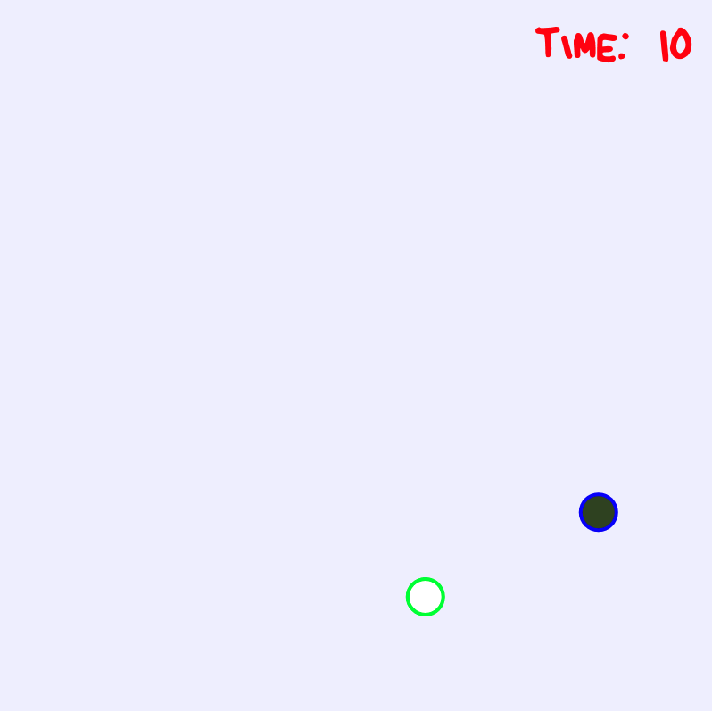 | 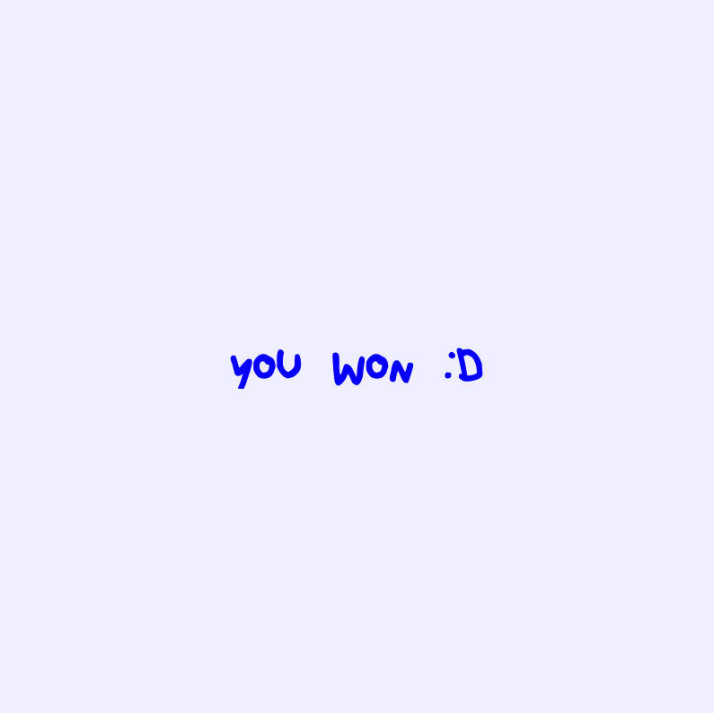 |


**Clock Tag**

As a child, ever looked at a traditional clock and followed the clock's seconds hand with intense
focus, impatiently awaiting for it to reach a certain time - either the minute mark, or the other hands
themselves, and rejoice of yet another turn around the clock?

Well this game is just that. Watch the seconds hand try to get to the minutes/hours hand in time, 
but with only 15 seconds to spare!

Ultimately this is a waiting game, and does not provide much agency to the player.
The only action the player can take is to choose when to start a game.
This leads to interesting emotional responses - confusion (no controls?), frustration (can't make it go faster?),
confusion again (I won? I lost?), frustration again (what kind of game is that?), but also comedy
(this is stupid and funny (especially with the soundtrack)) and curiosity (is there an Easter egg?
What does winning/losing look like?).

|     |     |     |
| --- | --- | --- |
| 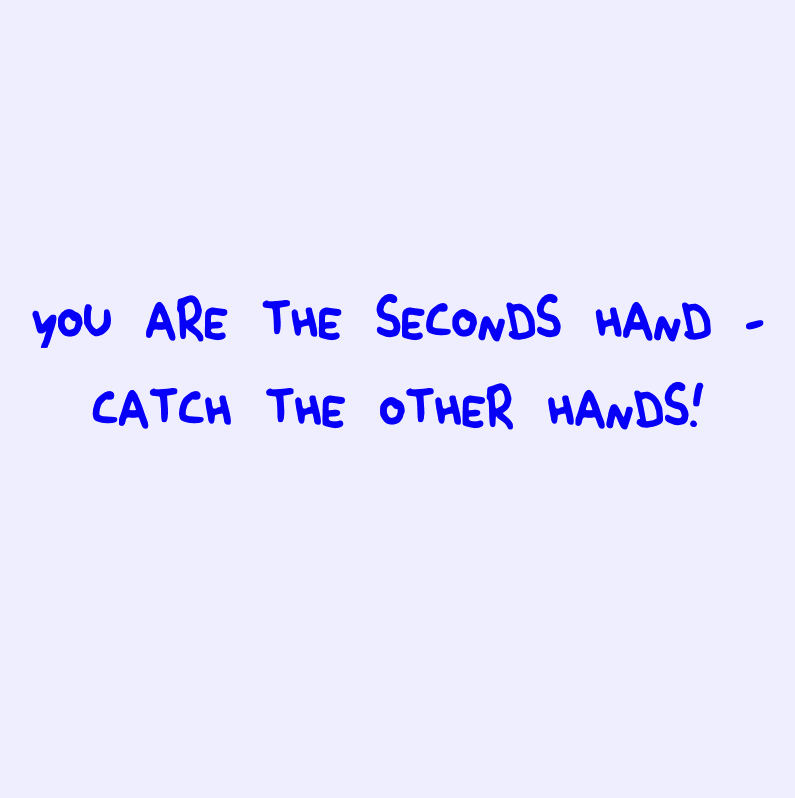 |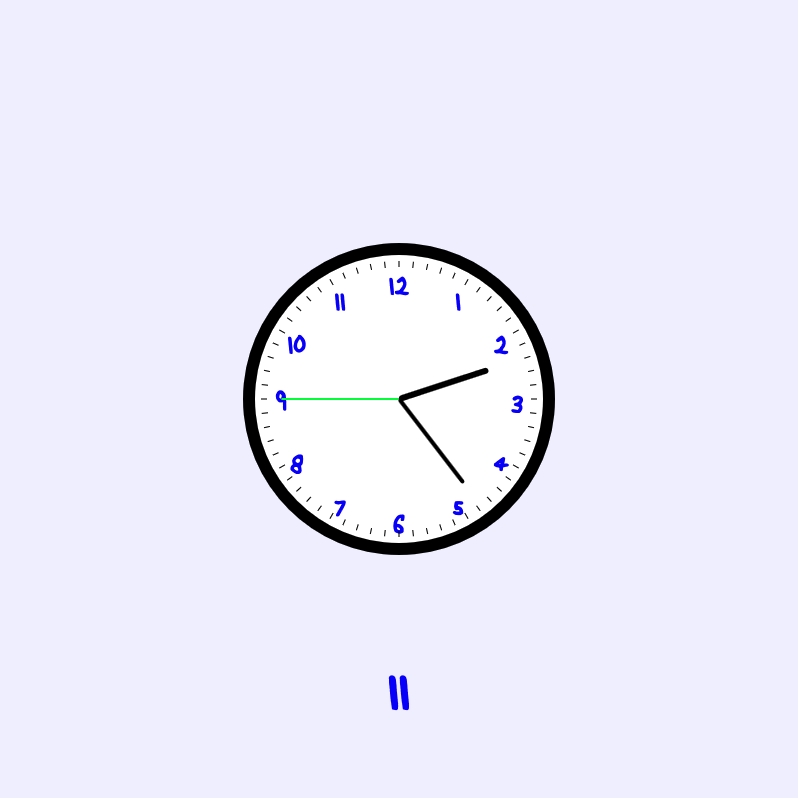| 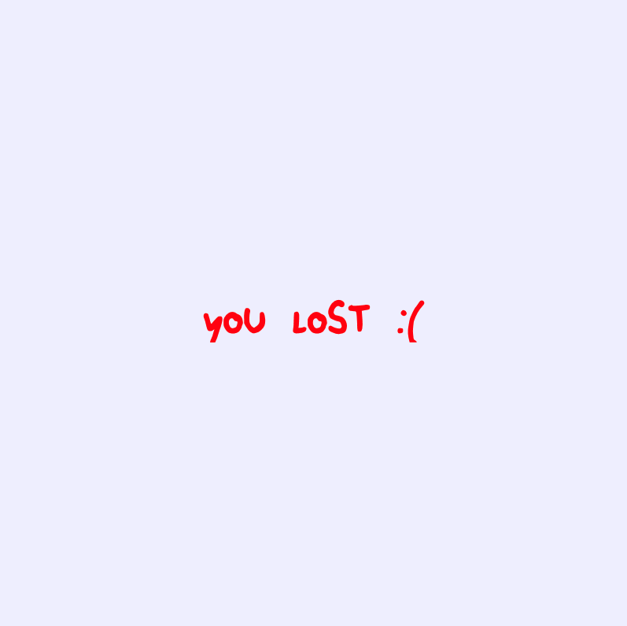 |

**Realistic Tag**

Nothing better than the real thing!
A joke variation that invites the player to go play tag IRL.
||||
|-|-|-|
||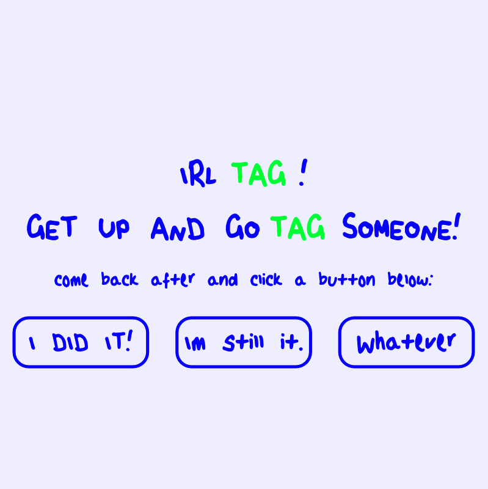||

I wanted to have a quirky version that would befuddle the player by asking them to do something outside of the game.
In the spirit of the Impossible Quiz, this quippy version of tag is simple to implement, yet will engage the players!

**Zombie Tag**

Zombie Tag, but with real zombies!</br>
Don't get caught or you will die!</br>
Last long enough to escape!</br>


| | | |
|-|-|-|
|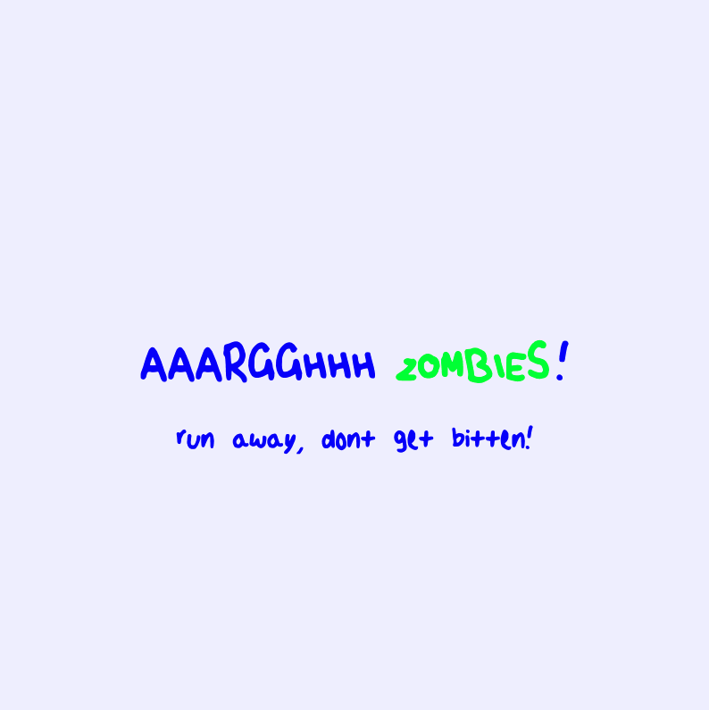|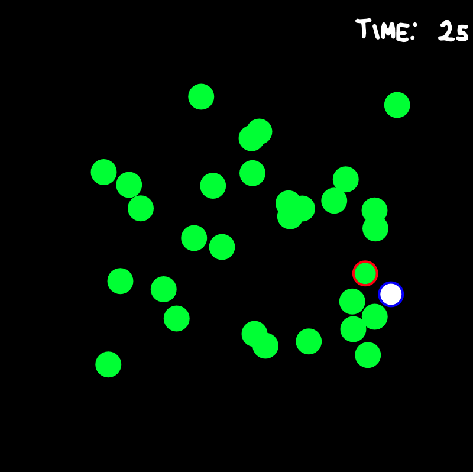|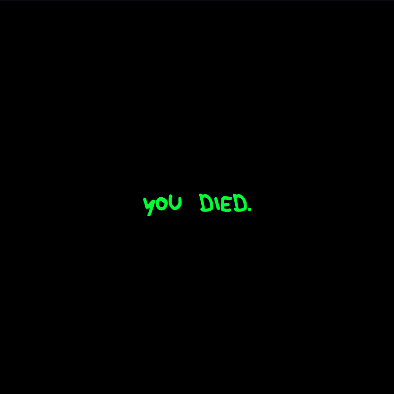|

The zombies in this game make noise, the music is creepy, and the danger is real!</br>
This version is inspired of the real-life zombie tag where once a player is tagged, they stay tagged until the end of the game. The last player not being it wins.</br>
I initially chose to go towards a more atmospheric version of the game to simplify implementation, but I realized that being swarmed by zombies also had its emotional potential, so I:

-  doubled down and changed the background to black
-  added rushers
-  added creepy musics
-  added zombie growls when the player passes close to a zombie.


## Creative Process

I was really excited for this variation jam! 
Really. I think the idea of exploring all the wacky, surprising ways that you can stretch
a simple game to learn the medium of Game Design is an absolutely great idea. </br>
I think this approach really creates stronger Game Design (Artists?) because it practices the fundamentals
of interactivity and the exploration of the medium, and helps create game makers who can build
strong games without relying on good graphics & flashy juiciness to create great experiences.

In this spirit, I wanted to find the simplest idea possible, which required the least visual flair
to work. I did a few Google Search for "simple games", "children games", "simple board games", and
I found the "tag" game (someone is it, touches another person, and that person becomes it) a very
fertile ground for ideas.

So I did a little brainstorm of ideas, trying to stretch the idea of "tag" across as many dimensions
as possible to distill what the game of "tag" is, and how far I can get before the game loses its
essence. I came with the conclusion that "tag" was a game of pursuing, catching, and evading.
With this distilled essence, I was able to expand my horizons.

Given the tag game is a children's game, I wanted to keep my project lighthearted, humorous, and
a bit taunting. So quickly my mind gravitated to the Impossible Quiz (a classic), and I took the
aesthetic from there.

### Developping the Game AI Engine

This is my first steps into the world of in-game AIs and state machines.
I knew this would be a complex endeavour, and indeed it was!
This being said, in comparison to making the FrogFrogFrog physics-simulated tongue,
this was a lot easier.

Having learnt data structures in SOEN back in 2013, and knowing a good deal about Graphs and Graph
theory, I had a solid inkling that movement would be done using a distance calculation algorithm,
like Djikstra's distance algorithm, on a grid-based graph of nodes with edges to all their neighbours.

What was fuzzier was what would be the appropriate design patterns to employ to bridge this pathfinding
algorithm with the in-game NPC and the display logic.

The resulting engine was developed entirely using GenAI and can be found under `js/src/engine`.

## Improvements & Areas to Improve

### What have I improved since the Mod Jam?

**Approach to Game Design**

I approached every game with the mindset: </br>
> How can I create an emotional experience and engage the user?

rather than the previous: </br>
> I have this idea of a mechanic or experience I want to do, how can I make it work?

This change re-focuses the design process on the player, rather than what I want, and also makes the brainstorm process more open-ended, allowing more creativity.

**Approach to Programming**

From the previous two jams, I really learnt that simple is often better from a programming standpoint. This jam tries to be as simple as possible within the constraints of the idea. Instead of hammering on on complex ideas, I chose to limit complexity, and welcome happy accidents when they happen.


### What can I still improve?

**Generative AI usage**

I would like to reduce my usage of generative AI moving on,
as I feel a bit like a fraud doing so.

**Time management**

This project happened within fairly difficult circumstances, and it was really hard to manage my time and energy. I think I could have done 20% better; this is always a work in progress.

**Code documentation**

Due to the time management issue, my documentation is a bit less comprehensive than I would have liked it to be.


## Structure of the code

This project is a lot simpler than the Mod Jam in terms of structure and in terms of functionality.

```
js/src
├── components                           # Reusable components
│   └── button.js                        # Button component   
├── engine                               # Game AI engine
│   ├── collision                        # Collision detection algorithms  
│   │   └── circle.js                    # Collision for circles      
│   ├── movement                         # Game AI movement component 
│   │   ├── agent.js                     # Agent – Composable entity with physics + movement ability
│   │   ├── behaviours.js                # Movement behaviours (pursuer, idle, evader)          
│   │   └── steering.js                  # Movement calculation utils        
│   ├── navigation                       # Game AI navigation component   
│   │   ├── distance-fields              # Distance Fields to navigate towards an objective            
│   │   │   ├── bfs-field.js             # Breadth-First-Search field over graph             
│   │   │   ├── euclidean-field.js       # Euclidean field (vectorial distance)                   
│   │   │   └── interfaces.js            # Base interface for fields              
│   │   ├── graph.js                     # Graph datastructure (Node + Adj Matrix)     
│   │   └── grid-graph.js                # Grid using graph representation          
│   ├── player                           # Player component
│   │   ├── controller                   # Bridge between input & in-game movement intention       
│   │   │   ├── interfaces.js            # Controller interface              
│   │   │   └── keyboard-controller.js   # Keyboard-input-to-intent controller                       
│   │   ├── intent.js                    # Intent type      
│   │   └── player.js                    # Player type - Top level type, like NPC      
│   ├── inputs.js                        # Inputs - Keyboard, Mouse  
│   └── npc.js                           # NPC type - Top level type
├── p5                                   # P5 utilities
│   ├── interfaces.js                    # P5 lifecycle interfaces (drawable, event listener, etc)      
│   ├── runtime.js                       # SceneManager that creates a canvas   
│   └── scene.js                         # Scene management: Scene, SceneRequest, SceneManager 
├── utils                                # General utilities
│   ├── coordinates.js                   # CoordinatesBox/Point; unused       
│   ├── fonts.js                         # FontBook - p5.Font cache system 
│   ├── functions.js                     # Helper functions     
│   └── sounds.js                        # SoundBook - p5.SoundFile cache system  
├── variations                           # Variations root dir
│   ├── classic-tag                      # Classic tag variation    
│   │   ├── scenes                          
│   │   │   ├── intro.js                          
│   │   │   ├── lose.js                          
│   │   │   ├── play.js                          
│   │   │   └── win.js                          
│   │   └── game.js                          
│   ├── clock-tag                        # Clock tag variation  
│   │   ├── components                          
│   │   │   └── clock.js                          
│   │   ├── scenes                          
│   │   │   ├── intro.js                          
│   │   │   ├── lose.js                          
│   │   │   ├── play.js                          
│   │   │   └── win.js                          
│   │   └── game.js                          
│   ├── realistic-tag                     # Realistic tag variation      
│   │   ├── scenes                          
│   │   │   ├── bailed-out.js                          
│   │   │   ├── lose.js                          
│   │   │   ├── play.js                          
│   │   │   └── win.js                          
│   │   └── game.js                             
│   └── zombie-tag                        # Zombie tag variation  
│       ├── scenes                          
│       │   ├── intro.js                          
│       │   ├── lose.js                          
│       │   ├── play.js                          
│       │   └── win.js                          
│       └── game.js                          
├── main.js                               # Entrypoint script; registers all scenes
├── menu.js                               # Menu scene
└── theme.js                              # Centralized styles for uniform usage
```


## Attribution & GenAI

### Assets

**Images**

All images are my own.

**Sounds**

All sounds were downloaded from YouTube using `yt-dlp`.</br>
Each sound file is suffixed with the YouTube video ID.</br>
Some of these may be copyrighted - namely Sonic The Hedgehog, Skyrim Quest Complete, and Minecraft Zombie sound Effect.

### Distribution of GenAI Contributions Across Files

```
js/src
├── components                           
│   └── button.js                        0%   
├── engine                               95% - Full attribution under engine/ATTRIBUTION
│   ├── collision                        100%
│   │   └── circle.js                    100%
│   ├── movement                         100%
│   │   ├── agent.js                     100%
│   │   ├── behaviours.js                100%
│   │   └── steering.js                  100%
│   ├── navigation                       100%
│   │   ├── distance-fields              100%            
│   │   │   ├── bfs-field.js             100%
│   │   │   ├── euclidean-field.js       100%
│   │   │   └── interfaces.js            100%
│   │   ├── graph.js                     100%, but that's available anywhere really
│   │   └── grid-graph.js                100%
│   ├── player                           100%
│   │   ├── controller                   100%
│   │   │   ├── interfaces.js            100%
│   │   │   └── keyboard-controller.js   100%
│   │   ├── intent.js                    100%
│   │   └── player.js                    100%
│   ├── inputs.js                        0%
│   └── npc.js                           80%, apply/clearModifier() & draw() are mine
├── p5                                   0%
│   ├── interfaces.js                    0%
│   ├── runtime.js                       0%
│   └── scene.js                         0%
├── utils                                15%
│   ├── coordinates.js                   0%
│   ├── fonts.js                         0%
│   ├── functions.js                     80% - throttle is AI-implemented; would be available in lodash
│   └── sounds.js                        0%  
├── variations                           5-10%
│   ├── classic-tag                      20%    
│   │   ├── scenes                       0%   
│   │   │   ├── intro.js                 0%         
│   │   │   ├── lose.js                  0%        
│   │   │   ├── play.js                  60% - Integration of engine is from GenAI        
│   │   │   └── win.js                   0%       
│   │   └── game.js                      0%    
│   ├── clock-tag                        0%
│   │   ├── components                   0%       
│   │   │   └── clock.js                 0%         
│   │   ├── scenes                       0%   
│   │   │   ├── intro.js                 0%         
│   │   │   ├── lose.js                  0%        
│   │   │   ├── play.js                  0%        
│   │   │   └── win.js                   0%       
│   │   └── game.js                      0%    
│   ├── realistic-tag                    0%
│   │   ├── scenes                       0%   
│   │   │   ├── bailed-out.js            0%              
│   │   │   ├── lose.js                  0%        
│   │   │   ├── play.js                  0%        
│   │   │   └── win.js                   0%       
│   │   └── game.js                      0%       
│   └── zombie-tag                       12%
│       ├── scenes                       0%   
│       │   ├── intro.js                 0%         
│       │   ├── lose.js                  0%        
│       │   ├── play.js                  40% - Integration of engine (copied from classic-tag)       
│       │   └── win.js                   0%       
│       └── game.js                      0%    
├── main.js                              0%
├── menu.js                              0%
└── theme.js                             0%
```

## License

_This project adheres to the [License section in the root README of this repository](https://github.com/philippefutureboy/cu-cart253/#License)._
